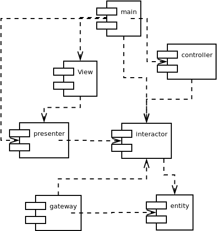

# High level architecture

## Components and dependencies

In diagram belows, the arrow indicates **dependencies**. Component A depends on Component B when Component B *knows* about Component A but Component A *knows nothing* about Component B.

The software contains following components:
- **entity:** Contains business logic. It has the highest policy so it doesn't need to know anything about other components.
- **interactor:** Contains application logic. It has the second highest policy so it only depends on **Entity** and doesn't depend on anything else.
- **controller:** Receives user's input and transform it into something that **interactor** can understand. Routing appropriate usecases.
- **presenter:** Transform **interactor's** output into **view**, which used to display to user.
- **gateway:** Data persistent.
- **main:** The ultimate details, which depends on lots of things.